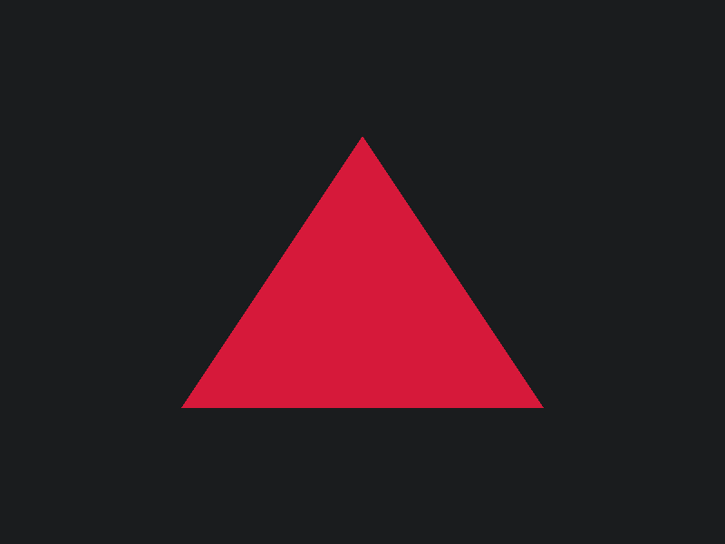
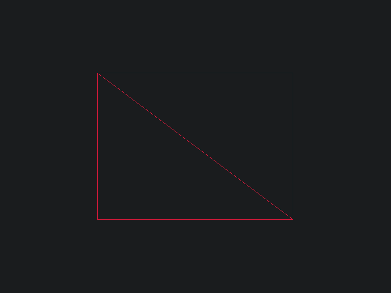
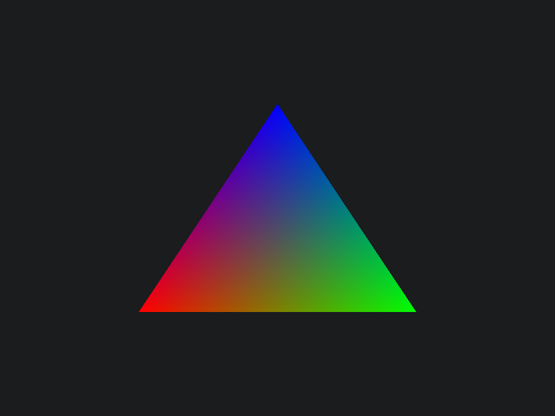
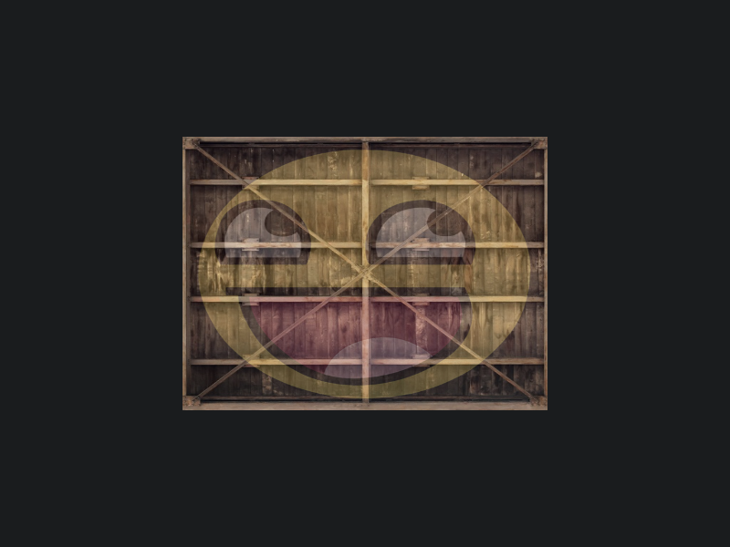
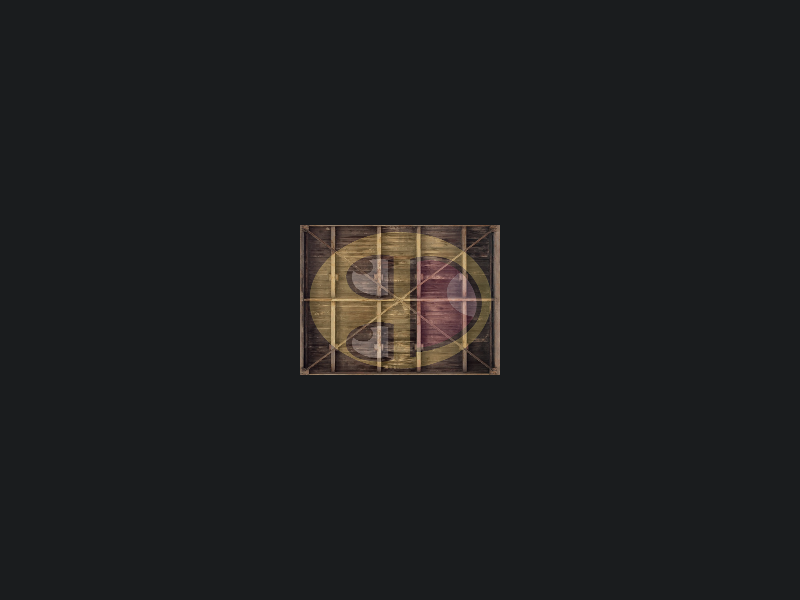
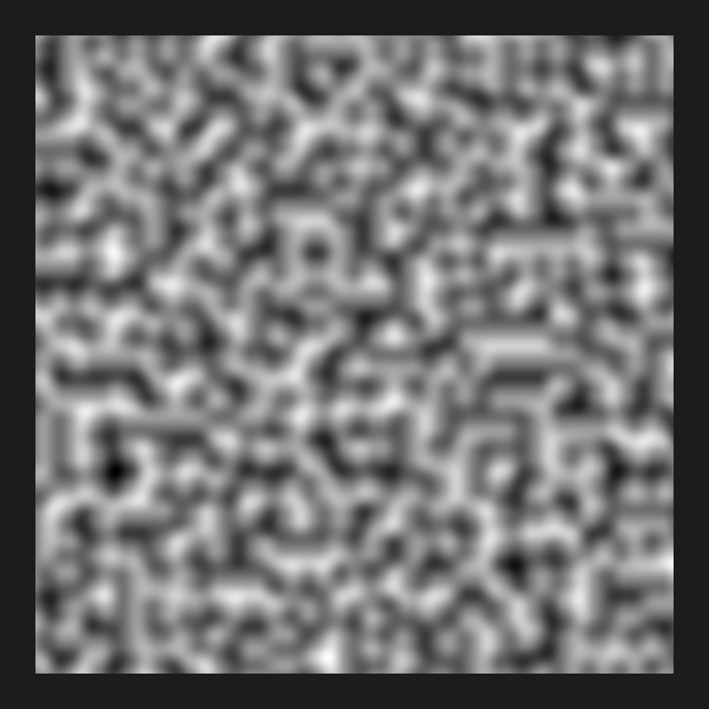
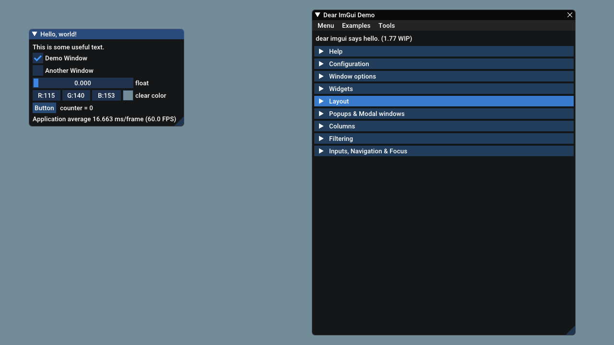

# OpenGL Practice
## Build Status
- Ubuntu / macOS 
- Windows 
- macOS Catalina 

## Screenshots
| #  | Lesson                                                                  | Screenshot                                                                          |
| :- | :---------------------------------------------------------------------- | :---------------------------------------------------------------------------------- |
|  1 | Hello window                                                            |                              |
|  2 | Hello triangle                                                          |                          |
|  3 | Hello rectangle                                                         |                        |
|  4 | Shaders                                                                 |                                        |
|  5 | Textures                                                                |                                      |
|  6 | Transformations                                                         |                        |
|  7 | Hello noise                                                             |                                |
|  8 | Hello ImGUI                                                             |                                |
