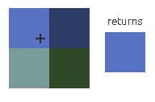
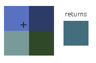
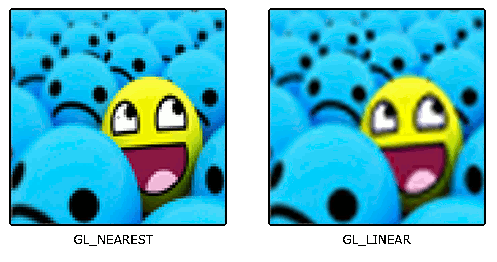

## Textures
- To map a texture to the triangle, we need to tell each vertex of the triangle which part of the texture it corresponds to.
- Each vertex should thus have a **texture coordinate** associated with them that specifies what part of the texture image to sample from.
- Texture coordinates range from 0 to 1 in the x and y axis. Retrieving the texture color using texture coordinates is called **sampling**.
- Texture coorinates start at (0, 0) for the lower left corner of a texture image to (1, 1) for the upper right corner of a texture image:
    ```ascii
                    (0.5,1)
        (0,1)_______________________(1,1)
            |           ^           |
            |          / \          |
            |         /   \         |
            |        /     \        |
            |       /       \       |
            |      /         \      |
            |     /           \     |
            |    /             \    |
            |   /               \   |
            |  /                 \  |
            | /                   \ |
        (0,0)/_____________________\(1,0)
    ```
- In code:
    ```c++
    float texCoords[] = {
        0.0f, 0.0f,  // lower-left corner
        1.0f, 0.0f,  // lower-right corner
        0.5f, 1.0f   // top-center corner
    };
    ```

## Texture Wrapping
-  Texture coorinates usually range from (0, 0) to (1, 1) but when we specify coordinates outside this range, the default behaviour is for OpenGL to repeat the texture images. But there are more options:
    1. `GL_REPEAT` - Default. Repeats the texture image.
    2. `GL_MIRRORED_REPEAT` - Same as `GL_REPEAT` but mirrors the image with each repeat.
    3. `GL_CLAMP_TO_EDGE` - Clamps the coordinates between 0 and 1. The result is that higher coordinates become clamped to the edge, resulting in a stretched edge pattern.
    4. `GL_CLAMP_TO_BORDER` - Coordinates outside the range are now given a user-specified border color.
- Each of the aforementined options can be set per coordinate axis (s, t (and r for 3D textures) equivalent to x, y, z) with the `glTexParameter` function:
    ```c++
    glTexParameteri(GL_TEXTURE_2D, GL_TEXTURE_WRAP_S, GL_MIRRORED_REPEAT);
    glTexParameteri(GL_TEXTURE_2D, GL_TEXTURE_WRAP_T, GL_MIRRORED_REPEAT);
    ```
- The 1st argument specifies the texture target
- The second specifies what option we want to set and for which texture axis. We want to configure the `WRAP` option and specify it for both the S and T axis.
- The last argument requires us to pass in the texture wrapping mode we'd like.
- If we choose the `GL_CLAMP_TO_BORDER` option we have to specify a border color using the `fv` equivalent of the `glTexParameter` function with `GL_TEXTURE_BORDER_COLOR` as its option and pass the array of the border's color value:
    ```c++
    float borderColor[] = {1.0f, 1.0f, 0.0f, 1.0f}
    glTexParameterfv(GL_TEXTURE_2D, GL_TEXTURE_BORDER_COLOR, borderColor);
    ```

## Texture Filtering
- Texture coordinates do not depend on resolution but can be any floating point value, thus OpenGL has to figure out which texture pixel (**texel**) to map the texture coordinate to.
- OpenGL has options to specify the **texture filtering** method:
    1. `GL_NEAREST`, aka ***nearest neighbor filtering***, is the default. OpenGL selects the pixel whose center is closest to the texture coordinate. The upper-left texel below has its center closest to the texture coordinate and is therefore chosen as the sampled color.  
        
    2. `GL_LINEAR`, aka ***(bi)linear filtering*** takes an interpolated value from teh texture coordinate's neighboring texels, approximating a color between the texels. The smaller the distance from the texture coordinate to a texel's center, the more that texels;s color contributes to the sampled color.  
        
- Here is a comparison when using a texture with a low resolution on a large object (texture is therefore scaled upwards and individual texels are noticeable).  
    
- Texture filtering can be set for **magnifying** and **minifying** operations (when scaling up or downwards). We specify this using `glTexParameter*`:
    ```c++
    glTexParameteri(GL_TEXTURE_2D, GL_TEXTURE_MIN_FILTER, GL_NEAREST);
    glTexParameteri(GL_TEXTURE_2D, GL_TEXTURE_MAG_FILTER, GL_LINEAR);
    ```

### Mipmaps
- They imporove performance.
- After a certain distance threshold from the viewer, OpenGL will use a different mipmap texture that best suits the distance to the object. Because the object is far away, the smaller resolution will not be noticeable to the user. 
- OpenGL can create mipmaps using `glGenerateMipmap` after we've created a texture.
- When switching mipmaps levels during rendering, some artifacts like sharp edges between the two mipmap layers can be visible.
- It is possible to filter between levels using `NEAREST` and `LINEAR` filtering for switching between mipmap levels.
- The filtering methods include:
    1. `GL_NEAREST_MIPMAMP_NEAREST` - takes the nearest mipmap to match the pixel size and uses the nearest neighbor interpolation for texture sampling.
    2. `GL_LINEAR_MIPMAP_NEAREST` - takes the nearest mipmap level and samples using linear-interpolation.
    3. `GL_NEAREST_MIPMAP_LINEAR` - linearly interpolates between two mipmaps that ost closely match the size of a pixel and samples via nearest neighbor interpolation.
    4. `GL_LINEAR_MIPMAP_LINEAR` - linearly interpolates between the two closest mipmaps and samples the texture via linear interpolation.
- We set to any of these filtering methods using `glTexParameteri`:
    ```c++
    glTexParameteri(GL_TEXTURE_2D, GL_TEXTURE_MIN_FILTER, GL_LINEAR_MIPMAP_LINEAR);
    glTexParameteri(GL_TEXTURE_2D, GL_TEXTURE_MAG_FILTER, GL_LINEAR);
    ```
- A common mistake is to set on e of the mipmap filtering options as the magnification filter. This does not have any effect since mipmaps are primarily used for when textures get downscaled: texture magnification does not use mipmaps and giving it a mipmap filtering optin will generate an OpenGL `GL_INVALID_ENUM` error code.

## Loading and Creating textures
- We'll use `stb_image.h`
- Simply download it and add it to your project and create an additional C++ file with the following code:
    ```c++
    #define STB_IMAGE_IMPLEMENTATION
    #include "stb_image.h"
    ```
- By defining `STB_IMAGE_IMPLEMENTATION`, the preprocessor modifies the header file such that it only contains the relevant definition source code, effectively turning the header file into a .cpp file. Now simply include `stb_image.h` in your program and compile.
- To load an image, use its `stbi_load` function:
    ```c++
    int width, height, nrChannels;
    unsigned char* data = stbi_load("container.jpg"), &width, &height, &nrChannels, 0);
    ```

## Generating a texture
- Textures are referenced with an ID:
    ```c++
    unsigned int texture;
    glGenTextures(1, &texture);
    ```
- `glGenTextures` takes as input how many textures we want to generate and stores them in a `unsigned int` array given as its second argument.
- Bind it so any subsequent texture commands will configure the currently bound texture:
    ```c++
    glBindTexture(GL_TEXTURE_2D, texture);
    ```
- Generate a texture using the previously loaded image data using `glTexImage2D`:
    ```c++
    glTexImage2D(GL_TEXTURE_2D, 0, GL_RGB, width, height, 0, GL_RGB, GL_UNSIGNED_BYTE, data);
    glGenerateMipmap(GL_TEXTURE_2D);
    ```
- Here are `glTexImage2D`s parameters:
    1. The first argument specifies the texture target. It can be `GL_TEXTURE_1D`, `GL_TEXTURE_2D` or `GL_TEXTURE_3D`. The currently bound `GL_TEXTURE_2D` which is specified is the one that gets worked on.
    2. The second specifies the mipmap level for which we want to create a texture for if you want to set each mipmap level manually, but we'll leave it at the base level which is 0.
    3. The third tells OpenGL i what kind of format we want to store the texture.
    4. The 4th and 5th set the width and height of the resulting texture.
    5. The next argument should always be 0 (some legacy stuff).
    6. The 7th and 8th specify the format and datatype of the source image. We loaded the image with RGB values and stored them as chars(bytes).
    7. The last arg is specify the actual image data.
- Once `glTexImage2D` is called, the currently bound texture object now has the texture image attached to it. However, it currently only has the base-level of the texture image loaded and if we want to use mipmaps, we have to specify all the different images manually (by continually incrementing the second argument) or we could call `glGenerateMipmap` after generating the texture. This will automatically generate all the required mipmaps for the currently bound texture.
- After we are done generating a texture and its corresponding mipmaps, it is good practice to free the image memory.
- Now the whole process looks like:
    ```c++
    unsigned int texture;
    glGenTextures(1, &texture);
    glBindTexture(GL_TEXTURE_2D, texture);
    glTexParameteri(GL_TEXTURE_2D, GL_TEXTURE_WRAP_S, GL_REPEAT);
    glTexParameteri(GL_TEXTURE_2D, GL_TEXTURE_WRAP_T, GL_REPEAT);
    glTexParameteri(GL_TEXTURE_2D, GL_TEXTURE_MIN_FILTER, GL_LINEAR);
    glTexParameteri(GL_TEXTURE_2D, GL_TEXTURE_MAG_FILTER, GL_LINEAR);
    // Load and generate the texture
    int width, height, nrChannels;
    unsigned char* data = stbi_load("container.jpg", &width, &height, &nrChannels, 0);
    if (data) {
        glTexImage2D(GL_TEXTURE_2D, 0, GL_RGB, width, height, 0, GL_RGB, GL_UNSIGNED_BYTE, data);
        glGenerateMipmap(GL_TEXTURE_2D);
    } else {
        std::cout << "Failed to load texture" << std::endl;
    }
    stb_image_free(data);
    ```

## Applying textures
- We'll extend the rectangle shape drawn with `glDrawElements`:
    ```c++
    float vertices[] = {
        // positions         // colors          // texture coords
        0.5f, 0.5f, 0.0f,   1.0f, 0.0f, 0.0f,  1.0f, 1.0f, // top right
        0.5f, -0.5f, 0.0f,  0.0f, 1.0f, 0.0f,  1.0f, 0.0f, // bottom right
        -0.5f, -0.5f, 0.0f, 0.0f, 0.0f, 1.0f,  0.0f, 0.0f, // bottom left
        -0.5f, 0.5f, 0.0f,  1.0f, 0.0f, 1.0f,  0.0f, 1.0f, // top left
    };
    ```
- Now pass the texture coordinates:
    ```c++
    glVertexAttribPointer(2, 2, GL_FLOAT, GL_FALSE, 8 * sizeof(float), (void*)(6 * sizeof(float)));
    glEnableVertexAttribArray(2);
    ```
- Note the stride and the offset.
- Now alter the vertex shader as well to accept the texture coordinates as a vertex attribute then forward them to the fragment shader
    ```c++
    #version 330 core
    layout (location = 0) in vec3 aPos;
    layout (location = 1) in vec3 aColor;
    layout (location = 2) in vec2 aTexCoord;

    out vec3 ourColor;
    out vec2 TexCoord;

    void main() {
        gl_Position = vec4(aPos, 1.0);
        ourColor = aColor;
        TexCoord = aTexCoord;
    }
    ```
- We pass the texture object to the fragment object using a GLSL data type for texture objects called a **sampler** that takes as a postfix the texture type we want e.g. `sampler1D`, `sampler2D` or `sampler3D`
- We can then add a texture to the fragment shader by declaring a *uniform sampler2D* that we later assign our texture to:
    ```c++
    #version 330 core
    out vec4 FragColor;

    in vec3 ourColor;
    in vec2 TexCoord;

    uniform sampler2D ourTexture;

    void main() {
        FragColor = texture(ourTexture, TexCoord);
    }
    ```
- We sample the color of a texture using GLSL's built in `texture` function that takes as its first argument a texture sampler and as its second argument the corresponding texture cordinate. The function the samples the corresponding color using the texture parameters we set earlier.
- Now bind the texture before calling the `glDrawElements` and it will then automatically assign the texture to the fragment shader's sampler:
    ```c++
    glBindTexture(GL_TEXTURE_2D, texture);
    glBindVertexArray(VAO);
    glDrawElements(GL_TRIANGLES, 6, GL_UNSIGNED_INT, 0);
    ```
- Voila, enjoy the render.
- You can get a little funky and mix the resulting texture color with the vertex colors. Simply multiply the resulting texture color with the vertex color in the fragment shader to mix both colors:
    ```c++
    FragColor = texture(ourTexture, TexCoord) ** vec4(ourColor, 1.0);
    ```

## Texture Units
- Using `glUniform1i` we can actually assign a *location* value to the texture sampler so we can set multiple texture at once in a fragment shader.
- The location of a texture is more commonly known as a `texture unit`. The default texture unit for a texture is 0 which is the default active texture unit so we did not have to assign a location in the previous section.
- Note that not all graphics drivers assign a default texture unit so the previous section may not have rendered anything.
- The main purpose of texture units is to allow us to use more than 1 texture in our shaders. By assigning texture units to the samplers, we can bind to multiple textures at once as long as we activate the corresponding texture unit first.
- Just like `glBindTexture`, we can activate texture units using `glActiveTexture` passing in the texture unit we'd like to use:
    ```c++
    glActiveTexture(GL_TEXTURE0); // activate the texture unit first before binding texture
    glBindTexture(GL_TEXTURE_2D, texture);
    ```
- After activating a texture unit, a subsequent `glBindTexture` call will bind that texture to the currently active texture unit.
- `GL_TEXTURE0` is always by default activated so we didn't have to activate any texture units i n the previous section.
------------------------------------------------------------------------------------------------
###### Note
- OpenGL should have a minimum of 16 texture units for use which you can activate using `GL_TEXTURE0` to `GL_TEXTURE15`. 
- They are defined in order so we could get `GL_TEXTURE8` via `GL_TEXTURE0 + 8`, which is usefule when looping.
------------------------------------------------------------------------------------------------
- We still have to edit the fragment shader to accept another sampler:
    ```c++
    #version 330 core

    uniform sampler2D ourTexture1;
    uniform sampler2D ourTexture2;

    void main() {
        FragColor = mix(texture(ourTexture1, TexCoord), texture(ourTexture2, TexCoord), 0.2);
    }
    ```
- GLSL's built in `mix` function takes two values as input and linearly interpolates between them based on its third argument. If it is 0.0, it returns the first input; if it's 1.0, it returns the second input value. 0.2 will return 80% of the first input color and 20% of the second.
- Now we load and create another texture, which you now know.
- To use the both textures, when rendering:
    ```c++
    glActiveTexture(GL_TEXTURE0);
    glBindTexture(GL_TEXTURE_2D, texture1);
    glActiveTexture(GL_TEXTURE1);
    glBindTexture(GL_TEXTURE_2D, texture2);

    glBindVertexArray(VAO);
    glDrawElements(GL_TRIANGLES, 6, GL_UNSIGNED_INT, 0);
    ```
- We also have to tell OpenGL to which texture unit each shader sampler belongs to by setting each sampler using `glUniform1i`. We only have to set this once:
    ```c++
    ourShader.use(); // Activate the shader before setting the uniforms!
    glUniform1i(glGetUniformLocation(ourShader.ID, "texture1"), 0); // set it manually
    ourShader.setInt("texture2", 1);// or with the shader class
    ```
- Most of the time the image seems flipped upside-down. This is because OpenGL expects the 0.0 coordinate on the y-axis to be ont he bottom side of the image, but images usually have 0.0 at the top of the y-axis. `stb_image.h` can flip the y-axis during image loading by adding the following statement before loading the any image.
    ```c++
    stbi_set_flip_vertically_on_load(true);
    ```
- Enjoy the render:

## Exercises:
- Make sure **only** the happy face loolks in the other/rev
- Make sure only the happy face looks in the other/reverse direction by changing the fragment shader.
- Experiment with the different texture wrapping methods by specifying texture coordinates in the range 0.0f to 2.0f instead of 0.0f to 1.0f. See if you can display 4 smiley faces on a single container image clamped at its edge: solution, result. See if you can experiment with other wrapping methods as well.
- Try to display only the center pixels of the texture image on the rectangle in such a way that the individual pixels are getting visible by changing the texture coordinates. Try to set the texture filtering method to `GL_NEAREST` to see the pixels more clearly.
- Use a uniform variable as the `mix` function’s third parameter to vary the amount the two textures are visible. Use the up and down arrow keys to change how much the container or the smiley face is visible.
