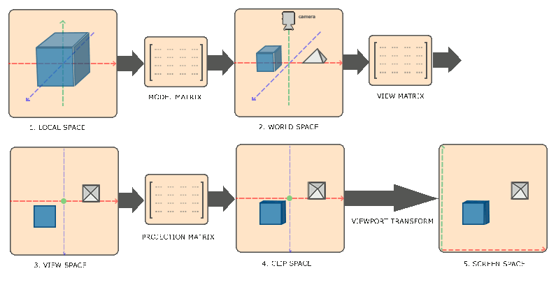
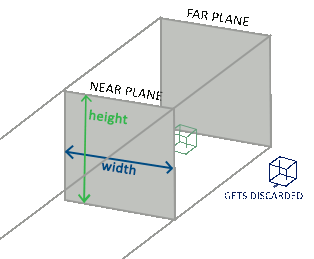
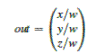
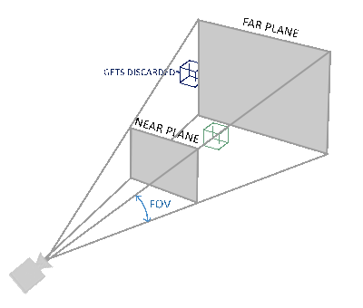
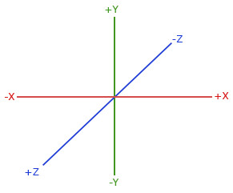

# Coordinate Systems
- Coordinates outside the normalized device coordinates are not made visible, usually.
- All vertices should be -1.0 and 1.0 if they are to be displayed on the screen.
- Normally, we specify coordinates in a range we configure ourselves and in the vertex shader transform these coordinates to NDC. These NDC coordinates are then given to the rasterizer to transfom them to 2D coordinates/pixels on the screen
- Transforming the coordinates to NDC and then to screen coordinates is usually accomplished in a step-by-step fashion where we translate an object's vertices to several coordinate systems before finally transforming them to screen coordinates.
- The coordinate systems include:
    1. Global space (or Object space)
    2. World Space
    3. View space (or Eye space)
    4. Clip space
    5. Screen space

## The global picture
- To transform the coordinates in one space to the next coordinate space, we'll use several transformation matrices of which the most important are **model**, **view** and **projection** matrix.
- Our vertex coordinates first start in **local space** as **local coordinates** and are then further processed to **world coordinates**, **view coordinates**, **clip coordinates** and eventually end up as **screen coordinates**.
    
    1. Local coordinates are the coordinates of your object relative to its local origin; they're the coordinates your object begins in.
    2. The next step is to transform the local coordinates to world-space coordinates which are coordinates in respect of a larger world. These coordinates are relative to a global origin of the world, together with many other objects also placed relative to the world's origin .
    3. The world coordinates are then transformed to view-space coordinates is as seen from the camera or viewer's point of view.
    4. We now want to project them to clip coordinates. Clip coordinates are processed to the -1.0 and 1.0 range and determine which vertices will end up on the screen.
    5. Lastly, we transform the clip coordinates to screen coordinates in a process called **viewport transform** that transforms the coordinates from the -1.0 and 1.0 to the coordinate range defined by `glViewport`.
    6. The resulting coordinates are then sent to the rasterizer to turn them into fragments.

##### Local space
- Is the coordinate space that is local to your object.
- e.g., a cube from blender has its origin at (0, 0, 0) even though the cube might end up at a different location.
- Probably all the models you've created all have (0, 0, 0) as their initial position.

##### World space
- We want to define a position for each object to position them inside a larger world.
- The coordinates of your object are transformed from the local to the world space via the **model** matrix.
- The model matrix is a transformation matrix that translates, scales and/or rotates your object to place it in the world at a location/orientation they belong to.

##### View space
- Is usually referred to as the **camera** of OpenGL, aka **camera space** or **eye space**.
- It is the result of transforming your world-space coordinates to coordinates that are in front of the user's view. It is the space as seen from the camera's point of view.
- This is achieved via a set of translations and rotations, a combined suite of translations that are generally stored inside a **view matrix**

##### Clip Space
- At the end of each vertex shader run, OpenGL expects the coordinates to be within a specific range and any coordinate that falls outside this range is **clipped**.
- Since working within -1.0 and 1.0 isn't intuitive, we specify our own coordinate set to work in then transform them back to NDC when we are done.
- We use a **projection matrix** that specifies a range of coordinates e.g. -1000 to 1000 in each dimension.
- The projection matrix then transforms coordinates within this specified range to NDCs (-1.0, 1.0).
- All coordinates outside the projection matrix' range wont be mapped to NDC and thus would be clipped, e.g. (1250, 500, 750) would not be visible if we used the above mentioned limits, since the x coordinate is out of range and thus gets converted to a coordinate higher than 1.0 in NDX.
    ```markdown
    If only a part of a primitive e.g. a triangle is outside the **clipping volume**, 
    OpenGL will reconstruct the triangle as one or more trangles to fit inside the 
    clipping range.
    ```

- This **viewing box** a projection matrix creates is called a **frustrum** and each coordinate that ends up inside this frustrum will end up on the user's screen.
- The total process to convert coordinates within a specified range to NDC that can be easily mapped to 2D view-space is called **projection** since the projection matrix projects 3D coordinates to the easy-to-map-to-2D NDCs.
- Once all the vertices are transformed to clip space, a final operation called **perspective division** is performed where whe divide the x, y, and z components of the position vectors by the vector's homogeneous `w` component; perspective division is what transforms the 4D clip space coordinates to 3D NDCs. This is performed automatically at the end of each vertex shader run.
- The resulting coordinates are mapped to screen coordinates using the settings of `glViewport` and turned into fragments
- A projection matrix to transform view coordinates to clip coordinates could be a **orthographic** or a **perspective** projection matrix.

## Orthographic projection
- An orthographic projection matrix defines a cube-like frustrum box that defines the clipping space where each vertex outside this box is clipped
- When creating the matrix, we specify the width, height, and length of the visible frustrum.
    
- The frustrum defines the visible coordinates and is specified by a width, a height and **near** and **far** plane.
- Any coordinate in front of the near plane is clipped and the same applies to coordinates behind the far plane.
- The orthographic frustrum directly maps all coordinates inside the frustrum to NDCs since the `w` component of each vector is untouched. 
- If the `w` component is equal to 1.0 perspective division doesn't change the coordinates.
- To create the matrix using glm:
    ```c++
    glm::ortho(0.0f, 800.0f, 0.0f, 600.0f, 0.1f, 100.0f);
    ```
- The first two parameters are the left and right coordinate of the frustrum and the third and fourth specify the bottom and top part of the frustrum. With these 4 point we've defined the size of the near and far planes.
- The 5th and 6th define the distances between the near and far plane.

## Perspective projection
- The projection matrix maps a given frustrum range to clip space, but also manipulates the `w` value of each vertex coordinate in such a way that the further away a vertex coordinate is from the viewer, the higher this `w` component become. 
- Once the coordinates are transformed to clip space they are in the range `-w` to `w`. Anything outside this range is clipped.
- Once the coordinates are in clip space, perspective division is applied to the clip space coordinates:  
    
- Each component of the vertex coordinate is divided by its `w` component giving smaller vertex coordinates the away a vertex is from the viewer.
- The `w` component is thus important since it helps us with perspective projection.
- The resulting coordinates are then in NDCs.
- A perspective frustrum can be visualized as:  
    
- A projection matrix in GLM is:
    ```c++
    glm::mat4 proj = glm::perspective(glm::radians(45.0f), (float)width/(float)height, 0.1f, 100.0f);
    ```
- The 1st parameter is the **fov** (field of view) value and sets how large the viewspace is. It is normally 45, but for more doom-style results you could set it to a higher value.
- The 2nd parameter is the aspect ratio which is calculated by dividing the viewport's width by its height.
- The 3rd and fourth set the *near* and *far* plane of the frustrum.
  ```markdown
  Whenever the near value of your perspective matrix is set a bit too high 
  (like 10.0f), OpenGL will clip all coordinates close to the camera 
  (between 0.0f and 10.0f), which gives a familiar visual result in videogames 
  in that you can see through certain objects if you move too close to them.
  ```
- Orthographic projection maps vertex coordinates directly to clip space without any fancy perpective fivision (it still does perspective division, but the `w` component is not manipulated (it stays 1) and thus has no effect).


## Putting it all together
- We create a transformation matrix for each of the aforementioned steps: model, view and projection matrix. A vertex coordinate is then transformed to clip coordinates as follows:
    ```ascii
    v_clip = M_projection * M_view * M.model * V_local
    ```
- Note that we read matrix multiplication from right to left.
- The resulting coordinate should be assigned to `gl_Position` and OpenGL will automatically perform perspective division and clipping on the *clip-space* coordinates to transform them to **normalized-device coordinates**.
- OpenGL then uses the parameters from `glViewport` to map the NDCs to *screen coordinates* where each coordinate corresponds to a point on your screen. This process is called **viewport transform**.

## Going 3D
- We start by creating a model matrix which will consist of translations, scaling and/or rotations we'd like to apply to *transform* all an object's vertices to the global world space.
- Let's transform our plane a bit by rotating it on the x-axis so it looks like it's laying on the floor:
    ```c++
    glm::mat4 model;
    model = glm::rotate(model, glm::radians(-55.0f), glm::vec3(1.0f, 0.0f, 0.0f));
    ```
- By multiplying the vertex coordinates with this model matrix, we're transform the vertex coordinates to world coordinates. Our plane is slightly on the floor thus represents the plane in the global world.
- Next we create a view matrix. We want to move slightly backwards in the scene so the object becomes visible (when in world space we're located at the origin (0, 0, 0)). To move around the scene, think about:
    - To move a camera backwards is the same as moving the entire scene forward.
- That is what a view matrix does, we move the entire scene around inversed to where we want the camera to move.
- Since we want to move backwards and since OpenGL is a right-handed system we have to move in the positive z-axs. We do this by translating the scene towards the negative z-axis. 
- This gives the impression that we are moving backwards.

##### Right-handed system.
- OpenGL is a right-haded system. The +ve x-axis is to your right, the positive y-axis is up and the positive z-axis is backwards.
- Think of your screen being the center of the 3 axes and the positive z-axis going through the screen towards you.  
    
- To understand why it is called the right-handed system:
    1. Stretch your right-arm along the positive y-axis with you hand up top.
    2. Let your thumb point to the right.
    3. Let your pointing finger point up.
    4. Now bend your middle finger downwards 90 degrees.
- Your thumb should point towards the +ve x-axis, the pointing finger towards the positive y-axis, and your middle finger towards the positive z-axis.
- Note that in NDCs, OpenGL actually uses a left-handed system (the projection matrix switches the handedness).
- Now the view matrix looks like this:
    ```c++
    glm::mat4 view;
    // note that we're translating the scene in the reverse direction of where we want to move
    view = glm::translate(view, glm::vec3(0.0f, 0.0f, -3.0f));
    ```
- Define the projection matrix:
    ```c++
    glm::mat4 projection;
    projection = glm::perspective(glm::radians(45.0f), screenWidth / screnHeight, 0.1f, 100.0f);
    ```
- Pass the transformation matrices to our shaders:
    ```c++
    #version 330 core
    layout (location = 0) in vec3 aPos;
    ...
    uniform mat4 model;
    uniform mat4 view;
    uniform mat4 projection;
    void main() {
        // note that we read the multiplication from right to left
        gl_Position = projection * view * model * vec4(aPos, 1.0);
        ...
    }
    ```
- We send the transformation matrices using uniforms, usually in the render loop as transformation matrices tend to change a lot:
    ```c++
    int modelLoc = glGetUniformLocation(ourShader.programID, "model");
    glGetUniformMatrix4fv(modelLoc, 1, GL_FALSE, glm::value_ptr(model));
    // same for the View and Projection matrices
    ```
- Enjoy the render! The final object should be:
    - Tilted backwards to the floor
    - A bit farther away from us.
    - Diplayed with perspective (it should get smaller, the further its vertices).

## More 3D
- To render a cube, we need a total of 36 vertices (6 faces * 2 triangles * 3 vertices each).
    ```c++
        float vertices[] = {
        -0.5f, -0.5f, -0.5f,  0.0f, 0.0f,
         0.5f, -0.5f, -0.5f,  1.0f, 0.0f,
         0.5f,  0.5f, -0.5f,  1.0f, 1.0f,
         0.5f,  0.5f, -0.5f,  1.0f, 1.0f,
        -0.5f,  0.5f, -0.5f,  0.0f, 1.0f,
        -0.5f, -0.5f, -0.5f,  0.0f, 0.0f,

        -0.5f, -0.5f,  0.5f,  0.0f, 0.0f,
         0.5f, -0.5f,  0.5f,  1.0f, 0.0f,
         0.5f,  0.5f,  0.5f,  1.0f, 1.0f,
         0.5f,  0.5f,  0.5f,  1.0f, 1.0f,
        -0.5f,  0.5f,  0.5f,  0.0f, 1.0f,
        -0.5f, -0.5f,  0.5f,  0.0f, 0.0f,

        -0.5f,  0.5f,  0.5f,  1.0f, 0.0f,
        -0.5f,  0.5f, -0.5f,  1.0f, 1.0f,
        -0.5f, -0.5f, -0.5f,  0.0f, 1.0f,
        -0.5f, -0.5f, -0.5f,  0.0f, 1.0f,
        -0.5f, -0.5f,  0.5f,  0.0f, 0.0f,
        -0.5f,  0.5f,  0.5f,  1.0f, 0.0f,

         0.5f,  0.5f,  0.5f,  1.0f, 0.0f,
         0.5f,  0.5f, -0.5f,  1.0f, 1.0f,
         0.5f, -0.5f, -0.5f,  0.0f, 1.0f,
         0.5f, -0.5f, -0.5f,  0.0f, 1.0f,
         0.5f, -0.5f,  0.5f,  0.0f, 0.0f,
         0.5f,  0.5f,  0.5f,  1.0f, 0.0f,

        -0.5f, -0.5f, -0.5f,  0.0f, 1.0f,
         0.5f, -0.5f, -0.5f,  1.0f, 1.0f,
         0.5f, -0.5f,  0.5f,  1.0f, 0.0f,
         0.5f, -0.5f,  0.5f,  1.0f, 0.0f,
        -0.5f, -0.5f,  0.5f,  0.0f, 0.0f,
        -0.5f, -0.5f, -0.5f,  0.0f, 1.0f,

        -0.5f,  0.5f, -0.5f,  0.0f, 1.0f,
         0.5f,  0.5f, -0.5f,  1.0f, 1.0f,
         0.5f,  0.5f,  0.5f,  1.0f, 0.0f,
         0.5f,  0.5f,  0.5f,  1.0f, 0.0f,
        -0.5f,  0.5f,  0.5f,  0.0f, 0.0f,
        -0.5f,  0.5f, -0.5f,  0.0f, 1.0f
    };
    ```
- For fun, rotate the cube over time:
    ```c++
    model = glm::rotate(model, 
                        (float)glfwGetTime() * glm::radians(50.0f), 
                         glm::vec3(0.5f, 1.0f, 0.0f));
    ```
- Then use `glDrawArrays`, but this time with a count of 36 vertices:
    ```c++
    glDrawArrays(GL_TRIANGLES, 0, 36);
    ```
- **Enjoy the render**
- Some sides of the cubes are being drawn over other sides of the cube. This happens because when OpenGL draws your cube triangle-by-triangle, it will overwrite its pixels even though something else might've been drawn there before.
- OpenGL stores depth information in a buffer called the `z-buffer` that allows OpenGL to decide when to draw over a pixel and when not to.
- We can use it to configure OpenGL to do depth-testing.

### Z-buffer
- OpenGL stores depth information in a z-buffer, a.k.a a `depth` buffer. GLFW automatically creates such a buffer.
- The depth is stored within each fragment (as the fragment's `z` value) and whenever the fragment wants to output its colour, OpenGL compares its depth values with the z-buffer and if the current fragment is behind the other fragment it is discarded, otherwise overwritten.
- This is process is called **depth testing** and is done automatically by OpenGL.
- However, if we want to make sure OpenGL actually performs the depth testing, we first need to tell OpenGL we want to enable depth testing; it is disabled by default. 
- We can enable depth testing using `glEnable`. The `glEnable` and `glDisable` functions allow us to enable/disable certain functionality in OpenGL.
- To enable depth testing, enable `GL_DEPTH_TEST`:
    ```c++
    glEnable(GL_DEPTH_TEST);
    ```
- Since we are using a depth buffer, we also want to clear the depth buffer before each render iteration:
    ```c++
    glClear(GL_COLOR_BUFFER_BIT | GL_DEPTH_BUFFER_BIT);
    ```
- **Enjoy the render.**

### More cubes:
- If we wanted to display 10 of our cubes, the only thing we have to change for each object is its model matrix where we transform the cubes into the world.
- First, let's define a translation vector for each cube that specifies it position in world space.
- We'll define 10 cube positions in a `glm::vec3` array:
    ```c++
    glm::vec3 cubePositions[] = {
        glm::vec3(0.0f, 0.0f, 0.0f),
        glm::vec3(2.0f, 5.0f, -15.0f),
        glm::vec3(-1.5f, -2.2f, -2.5f),
        glm::vec3(-3.8f, -2.0f, -12.3f),
        glm::vec3( 2.4f, -0.4f, -3.5f),
        glm::vec3(-1.7f, 3.0f, -7.5f),
        glm::vec3( 1.3f, -2.0f, -2.5f),
        glm::vec3( 1.5f, 2.0f, -2.5f),
        glm::vec3( 1.5f, 0.2f, -1.5f),
        glm::vec3(-1.3f, 1.0f, -1.5f)
    };
    ```
- Now within the game loop, we want to call the `glDrawArrays` function 1 times, but this time send a different model matrix to the vertex shader each time before we render.
    ```c++
    glBindVertexArray(VAO);
    for(unsigned int i = 0; i < 10; i++) {
        glm::mat4 model;
        model = glm::translate(model, cubePositions[i]);
        float angle = 20.0f * i;

        model = glm::rotate(model, glm::radians(angle), glm::vec3(1.0f, 0.3f, 0.5f));
        ourShader.setMat4("model", model);

        glDrawArrays(GL_TRIANGLES, 0, 36);
    }
    ```
- *Enjoy the render*

## Exercises:
- Try experimenting with the FoV and aspect-ratio parameters of GLM’s projection function. See if you can figure out how those affect the perspective frustum.
- Play with the view matrix by translating in several directions and see how the scene changes. Think of the view matrix as a camera object.
- Try to make every 3rd container (including the 1st) rotate over time, while leaving the other containers static using just the model matrix.
